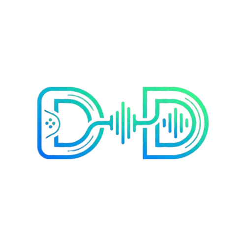
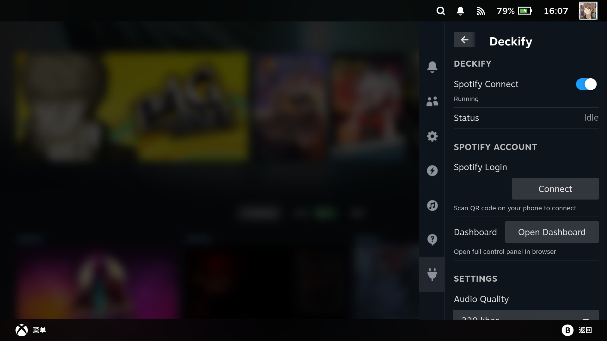
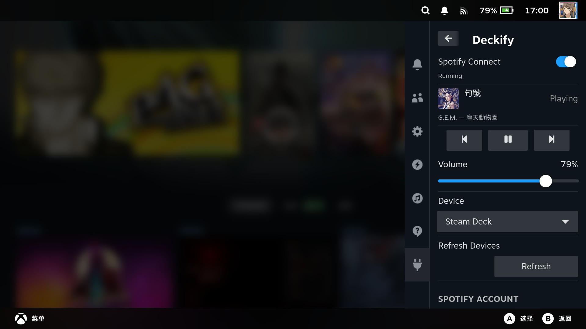
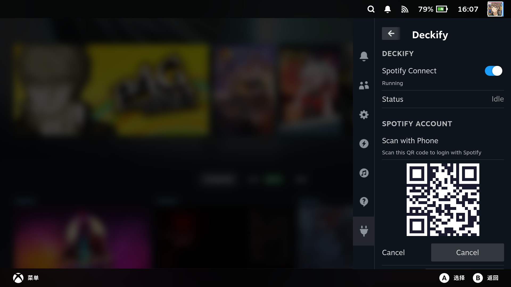
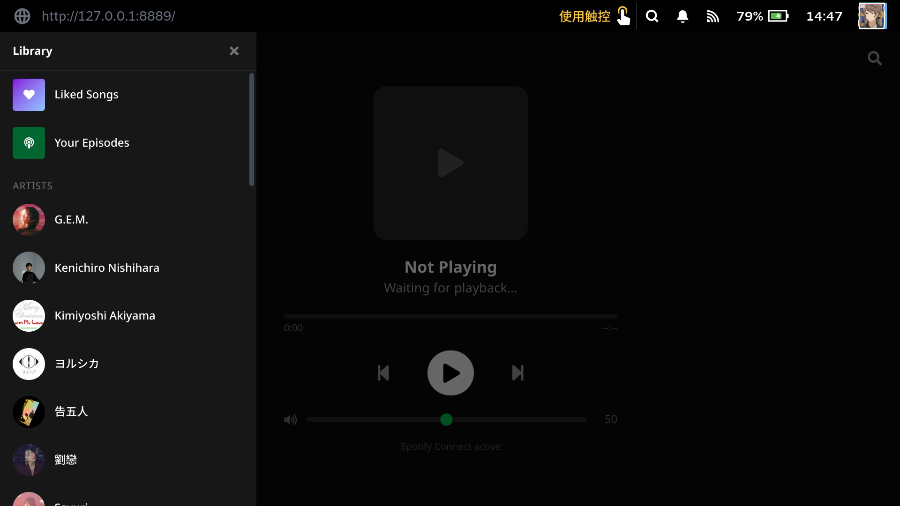
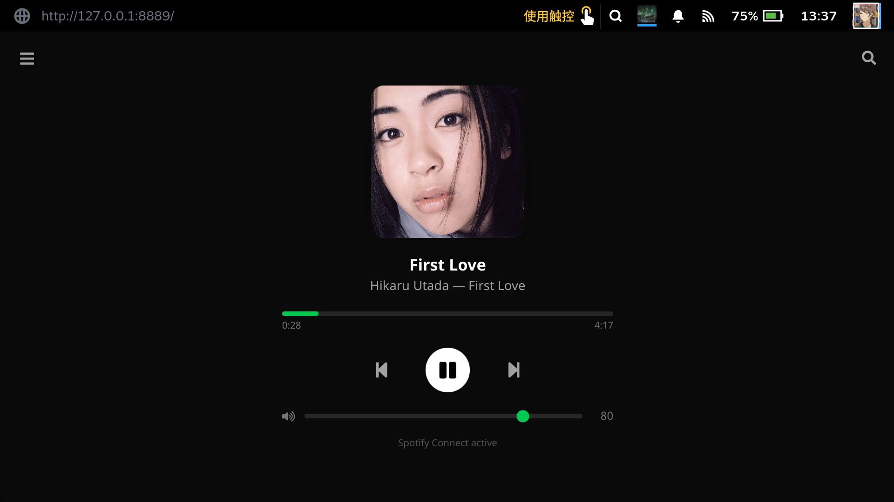
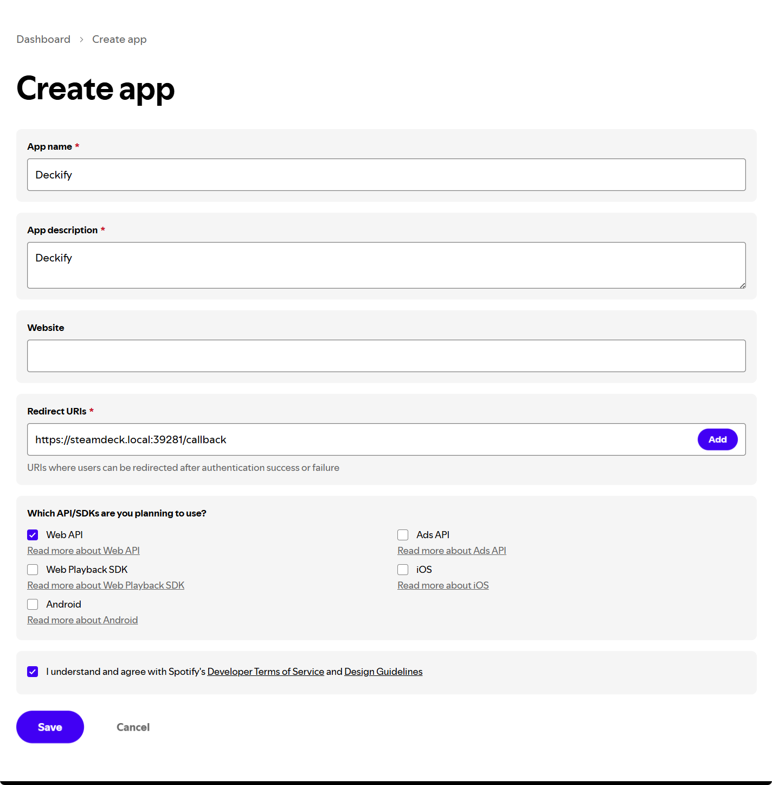

<p align="center">
  
</p>

<h1 align="center">Deckify</h1>

<p align="center">A Spotify music manager for Steam Deck, built as a <a href="https://github.com/SteamDeckHomebrew/decky-loader">Decky Loader</a> plugin.</p>

<p align="center">English | <a href="README_ZH.md">中文</a> | <a href="README_JP.md">日本語</a></p>

## Features

- **Spotify Connect** — Steam Deck appears as a Spotify Connect device via [librespot](https://github.com/librespot-org/librespot)
- **Playback Controls** — Play/pause, skip, previous, volume from the Quick Access panel
- **Device Management** — View and transfer playback between Spotify Connect devices
- **Web Dashboard** — Full Now Playing UI with library browsing in the Steam browser
- **OAuth (PKCE)** — Secure Spotify login via QR code, no server required

## Screenshots

| Quick Access Panel | Playback Controls |
|:--:|:--:|
|  |  |

| QR Code Login | Dashboard Library |
|:--:|:--:|
|  |  |

| Web Dashboard |
|:--:|
|  |

## Install

Requires [Decky Loader](https://github.com/SteamDeckHomebrew/decky-loader) installed on your Steam Deck.

```bash
curl -fsSL https://deckify.advinn.co/install.sh | sh
```

To uninstall:

```bash
curl -fsSL https://deckify.advinn.co/uninstall.sh | sh
```

## Spotify Account Setup

Each user must register a Spotify App at [developer.spotify.com](https://developer.spotify.com):

1. Create a new app with the following settings:
   - **App name:** `Deckify`
   - **App description:** `Deckify`
   - **Redirect URI:** `https://steamdeck.local:39281/callback`
   - Check **Web API**

   

2. Copy the **Client ID** and enter it in the plugin's Spotify Login flow
3. When scanning the QR code, your browser may show a certificate security warning — this is expected (self-signed cert for local HTTPS). Proceed to continue.
4. If you changed your Steam Deck's hostname, replace `steamdeck` in the redirect URI accordingly
5. Spotify development mode limits each Client ID to 5 authorized users

> **Note:** Devices running OpenHarmony are not supported at this time due to the lack of mDNS / Zeroconf discovery.

## Known Issues

- **Device list delayed after wake from sleep** — When the Steam Deck wakes from suspend, librespot needs a few seconds to restart and re-register with Spotify. During this window, the device list may only show other devices. Wait a moment and refresh.
- **Device selector not updating instantly** — After switching devices in the dropdown, the selection may briefly stay on the previous device. This is due to Spotify API propagation delay — the new active device will reflect after a short wait.

## Development

### Prerequisites

- Node.js v16.14+
- pnpm v9

### Build

```bash
pnpm i
pnpm run build    # builds plugin frontend + dashboard
```

### Deploy to Steam Deck

```bash
./deploy.sh               # uses .vscode/settings.json defaults
./deploy.sh --build        # build before deploying
./deploy.sh deck@10.0.0.5  # override target
```

## Acknowledgments

- [librespot](https://github.com/librespot-org/librespot) (MIT) — Open source Spotify client library
- [Decky Loader](https://github.com/SteamDeckHomebrew/decky-loader) — Plugin framework for Steam Deck
- [@decky/ui](https://github.com/SteamDeckHomebrew/decky-frontend-lib) — Steam-native React components

## License

GPL-3.0
